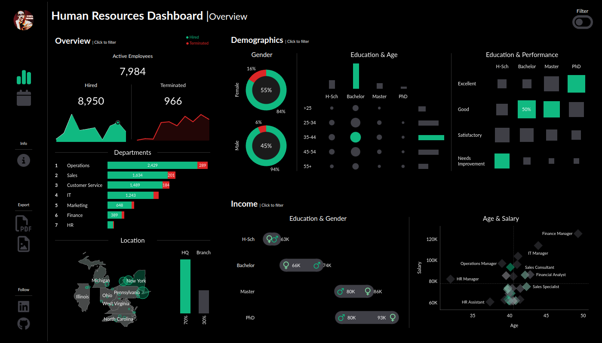
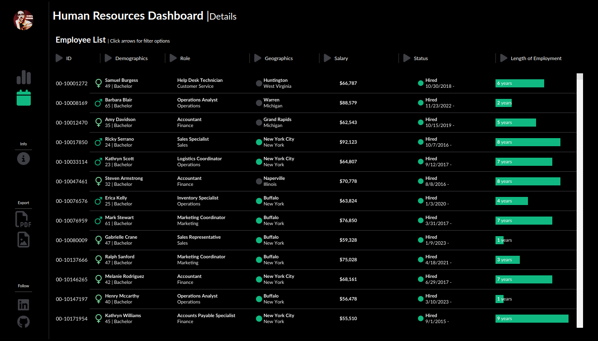

# HR Dashboard

A comprehensive dashboard to analyze human resource data providing both summary views for high-level insights and detailed employee records for in-depth analysis.

## Summary View

The summary should be divided into these many sections: overview, Diagnostics and Income Analysis

### Overview

The overview section should provide a snapshot of the overall HR metrics, including:

- Display the total number of hired employees, active employees, and terminated employees.
- Visualize the total number of hired and terminated employees over the years.
- Present a breakdown of total employees by department and job titles.
- Compare total employees between headquarters (HQ) and branches (New York is the HQ)
- Show the distribution of employees by city and state.

### Demographics

The Demographics section should offer insights into the composition of the workforce, including:

- Present the gender ration in the company
- Visualize the distribution of the employees across age groups and education levels.
- Show the total number of employees across age groups and education levels.
- Present the collection between employee's educational backgrounds and their performance ratings.

### Income

The income analysis section should focus on salary-related metrics, including:

- Compare salaries across different education levels for both gender to identify and discrepancies or patterns.
- Present how the age correlate with the salary for employees in each department.

## Employee Records View

- Provide a comprehensive list of all employees with necessary information such as name department, position, gender, age, education, and salary.
- Users should be able to filter the list based on any of the available columns.

## Project Screenshots

### HR-Dashboard | Overview

### HR-Dashboard | Details

